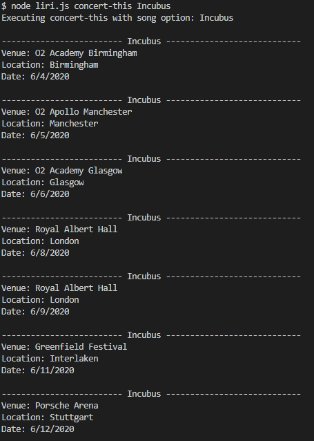

# liri-node-app

### Developer - Justin Wells
[My Portfolio](https://jwellstx.github.io/My_Portfolio/)

## Overview
The purpose of this application is to provide a commandline interpreter which takes in a users request to either search for a songs information using the [Spotify](https://www.npmjs.com/package/node-spotify-api) npm, query for movie details using the [OMDB](http://www.omdbapi.com/) API, or lastly search for a users favorite band and return all the artists up and coming tour dates and venues using the [Bands in Town](https://www.artists.bandsintown.com/login) API. 

Some other libraries that were used in developing this application were [fs](https://www.npmjs.com/package/fs), [axios](https://www.npmjs.com/package/axios), [request](https://www.npmjs.com/package/request), and [moment](https://www.npmjs.com/package/moment).

<br /><br />

## Demo

 

<br /><br />

## Usage
1. Access the commandline for the `liri-node-app` by checking out the code.
2. Create a .env file which contains your `SPOTIFY_ID` and `SPOTIFY_SECRET` obtained from [Spotify Developers Page](https://developer.spotify.com/).

```
# Spotify API keys

SPOTIFY_ID=your-spotify-id
SPOTIFY_SECRET=your-spotify-secret
```
3. Launch the liri app using the following syntax: `node liri.js <action> <argument>`
   1. Search for song information on Spotify using: `node liri.js spotify-this-song piano man`
   2. Request movie information using: `node liri.js movie-this Interstellar`
   3. Find your favorite bands tour dates and venues using: `node liri.js concert-this Incubus`
   4. Execute multiple commands from random.txt using: `node liri.js do-what-it-says`
       1. To enable this feature, add your commands in random.txt as such.
       
```
spotify-this-song,"I Want it That Way"
concert-this,"Incubus"
movie-this,"Tommy Boy"
```

<br /><br />

## Code Structure
1. `liri.js` will first take in all arguments and process the action argument in `pickAction` function and will respectively call either `concert_this`, `spotify_this_song`, `movie_this` or `do_what_it_says`.
   1. `concert_this` function uses a mixture of `request` library and the Bands In Town API to query the band name and return a response.  The response is then parsed and printed to the console of all tour dates and locations.
   2. `spotify_this_song` function utilizes the `node-spotify-api` npm to query the spotify API and return song information which is then display in the console.
   3. `movie_this` function is similar to the conert function except that is utilizes the OMDB API and a different HTTP protocol called `axios` which is another npm package.
   4. `do-what-is-says` function will read in a file using the `fs` npm package, parse each command then run the respective function above.
   5. Lastly, all commands and their outputs are logged in `log.txt`

<br /><br />

## Additonal Images
<br />
# movie-this

<br />
# spotify-this-song

<br />
# concert-this

<br />
# do-what-it-says

<br />
